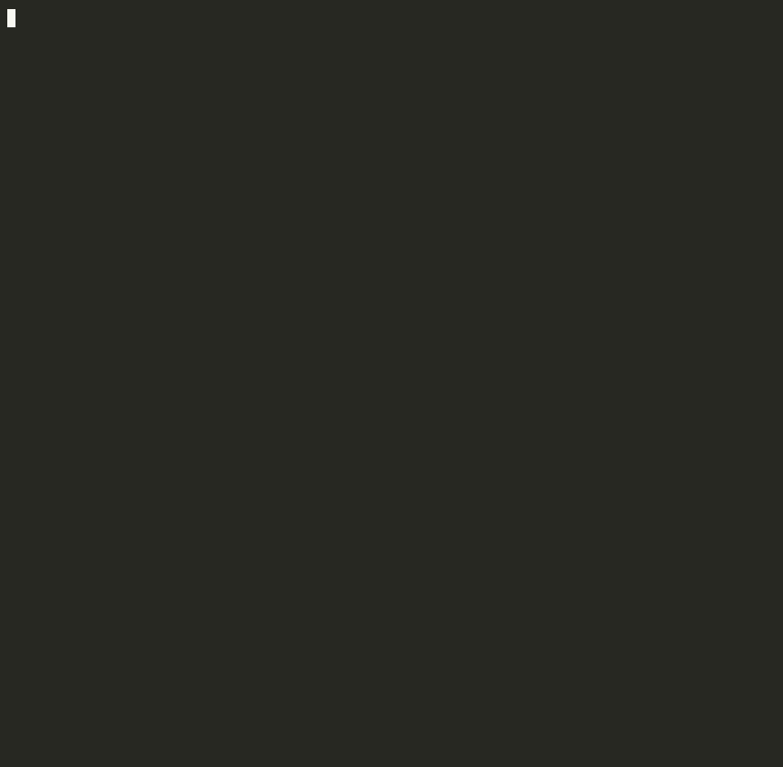

<div align="center">

# ⚒️ Cargo-Forge

**A Rust project generator with templates and common features**

[](https://crates.io/crates/cargo-forge)
[](https://docs.rs/cargo-forge)
[](https://github.com/marcuspat/cargo-forge#license)
[](https://github.com/marcuspat/cargo-forge)

*Generate Rust projects with templates and optional features*

</div>

## 🎬 Demo



*Recorded from the actual binary with [asciinema](https://asciinema.org) + [agg](https://github.com/asciinema/agg).*

## 🚀 Quick Start

```bash
# Install cargo-forge
cargo install cargo-forge

# Create a new project interactively
cargo-forge new

# Or specify project type directly
cargo-forge new my-api --project-type api-server

# Initialize in current directory
cargo-forge init --project-type library
```

📖 See [Quick Reference](docs/QUICK_REFERENCE.md) for shell completions and common commands, or [Troubleshooting](docs/TROUBLESHOOTING.md) for platform-specific install issues.

## ✨ Features

### 🎯 Project Types

Cargo-Forge supports 7 project types with templates:

| Type | Description | Key Features |
|------|-------------|--------------|
| **cli-tool** | Command-line applications | • Clap dependency setup<br>• Basic project structure<br>• Ready for CLI development |
| **library** | Rust library crates | • Library template<br>• Examples directory<br>• Documentation ready<br>• Tests structure |
| **api-server** | REST API servers | • Axum web framework<br>• Basic HTTP server setup<br>• Route handlers structure<br>• Ready for API development |
| **wasm-app** | WebAssembly applications | • wasm-bindgen setup<br>• Web-sys integration<br>• Build scripts<br>• HTML template |
| **game-engine** | Game development | • Bevy engine<br>• Asset pipeline structure<br>• Basic game setup<br>• Development ready |
| **embedded** | Embedded systems | • no_std setup<br>• Memory configuration<br>• HAL integration<br>• Debug configs |
| **workspace** | Multi-crate projects | • Organized structure<br>• Shared dependencies<br>• Cross-crate testing<br>• Unified configuration |

_Note: the `cli-tool` and `api-server` templates currently generate placeholder/stub files for the core logic (`handlers.rs`, `routes.rs`, `models.rs`) rather than working implementations -- treat "Route handlers structure" etc. above as scaffolding to fill in, not functional code out of the box._

### 🛠️ Core Features

Current features available in v0.1.6:

#### **Project Structure**
- **Clean Templates**: Well-organized project structures for each type
- **Dependency Management**: Appropriate dependencies for each project type
- **Documentation**: README files with project-specific instructions
- **Testing Setup**: Basic test structure and configuration

#### **Development Tools**
- **Dry Run Mode**: Preview project structure before creation
- **Non-interactive Mode**: CI-friendly project generation
- **Name Validation**: Ensures valid Cargo package names
- **Shell Completions**: Bash, zsh, fish, and PowerShell support

#### **Future Features** (Planned)
- **CI/CD Integration**: GitHub Actions and GitLab CI templates
- **Database Support**: PostgreSQL, MySQL, and SQLite integration
- **Authentication**: JWT, OAuth, and password authentication
- **Docker**: Multi-stage Dockerfile and docker-compose setup
- **Advanced Templates**: Feature-rich project templates

## 📋 Comparison with cargo-generate

| Feature | cargo-forge | cargo-generate |
|---------|------------|----------------|
| **Interactive Mode** | ❌ Planned for future | ❌ Requires manual input |
| **Project Types** | ✅ 7 specialized types | ⚠️ Generic templates |
| **Defaults** | ✅ Pre-configured options | ❌ Manual configuration |
| **Name Validation** | ✅ Built-in validation | ⚠️ Basic validation |
| **Dry Run Mode** | ✅ Preview before creation | ❌ Not available |
| **Non-interactive Mode** | ✅ CI-friendly with defaults | ✅ Available |
| **Custom Templates** | ✅ Tera templates | ✅ Various engines |
| **Shell Completions** | ✅ All major shells | ⚠️ Manual setup |
| **Error Recovery** | ✅ Graceful handling | ⚠️ Basic errors |
| **Performance** | ✅ <0.1s generation | ⚠️ Varies by template |

## 🎮 Usage Examples

### Command-Line Mode (Current)

```bash
# Create an API server with PostgreSQL and JWT auth
cargo-forge new my-api \
  --project-type api-server \
  --author "Jane Doe" \
  --description "My awesome API"

# Create a CLI tool in non-interactive mode (great for CI)
cargo-forge new my-cli \
  --project-type cli-tool \
  --non-interactive

# Initialize a library in current directory
cargo-forge init --project-type library

# Dry run to preview what will be created
cargo-forge new my-project --dry-run

# Use saved configuration
cargo-forge new my-project --from-config ~/.forge/defaults.toml
```

### Advanced Usage

```bash
# Create a workspace with multiple crates
cargo-forge new my-workspace --project-type workspace

# Generate a game with Bevy engine
cargo-forge new my-game --project-type game-engine

# Create an embedded project for STM32
cargo-forge new my-firmware --project-type embedded
```

## 📁 Generated Project Structure

### Example: API Server

```
my-api/
├── src/
│   ├── main.rs           # Application entry point
│   ├── handlers.rs       # HTTP handlers (basic structure)
│   ├── routes.rs         # Route definitions (basic structure)
│   └── models.rs         # Data models (basic structure)
├── config/
│   └── default.toml      # Configuration template
├── tests/                # Test directory
├── .gitignore            # Git ignore file
├── Cargo.toml            # Project manifest with Axum dependencies
└── README.md             # Project documentation
```

## 🔧 Configuration

### Command-Line Options

Cargo-Forge supports various command-line options:

```bash
# Non-interactive mode (great for CI/CD)
cargo-forge new my-project --project-type api-server --non-interactive

# Dry run to preview what will be created
cargo-forge new my-project --project-type library --dry-run

# Initialize in current directory
cargo-forge init --project-type cli-tool
```

### Project Customization

After project creation, you can customize:
- Add dependencies to `Cargo.toml`
- Modify source files to fit your needs
- Update configuration files as needed
- Add additional features and integrations

## 📊 Template Syntax

Cargo-Forge uses Tera templates with custom helpers:

```rust
// Conditional compilation based on features

use sqlx::{PgPool, postgres::PgPoolOptions};


// Smart defaults with fallbacks
const PORT: u16 = {{ port | default(value=3000) }};

// Case transformations
mod {{ name | snake_case }};
struct {{ name | pascal_case }};

// Feature combinations

// Authentication with database backend

```

## 🧪 Testing

Generated projects include comprehensive test setups:

```bash
# Run all tests
cargo test

# Run with coverage
cargo tarpaulin

# Benchmarks (if enabled)
cargo bench

# Property tests (if enabled)
cargo test --features proptest
```

## 🚢 CI/CD Integration (Planned)

Not yet implemented (see Future Features above) — the goal is for every project type to optionally include:

### GitHub Actions
- Multi-platform testing (Windows, Mac, Linux)
- Rust version matrix (stable, beta, nightly)
- Security audits and dependency checks
- Release automation with cargo-release
- Code coverage with Codecov

### GitLab CI
- Cached dependencies for faster builds
- Parallel job execution
- Deploy stages for different environments
- Container registry integration

## 🐳 Docker Support (Planned)

Not yet implemented. Generated Dockerfiles would use multi-stage builds for optimal image size, along the lines of:

```dockerfile
# Build stage
FROM rust:1.70 as builder
WORKDIR /app
COPY . .
RUN cargo build --release

# Runtime stage
FROM debian:bookworm-slim
COPY --from=builder /app/target/release/app /usr/local/bin/
CMD ["app"]
```

## 🔒 Security

Properties of the generated templates today:

- No hardcoded secrets in templates
- Secure default configurations
- Environment variable usage for sensitive data

**Planned:** security audit integration in CI and OWASP-aligned checks for the `api-server` template — both depend on the CI/CD integration above, which isn't implemented yet.

## 🤝 Contributing

We love contributions! See [CONTRIBUTING.md](CONTRIBUTING.md) for guidelines.

### Development Setup

```bash
# Clone the repository
git clone https://github.com/marcuspat/cargo-forge
cd cargo-forge

# Run tests
cargo test

# Run with coverage
cargo tarpaulin

# Build for release
cargo build --release
```

## 📈 Performance

Cargo-Forge is optimized for speed:

- Project generation: <0.1 seconds (extremely fast!)
- Template rendering: <10ms
- Name validation: <1ms
- Cross-platform: Works on Windows, Mac, and Linux

## 🐛 Troubleshooting

### Common Issues

**Q: Command not found after installation**
```bash
# Ensure cargo bin directory is in PATH
export PATH="$HOME/.cargo/bin:$PATH"
```

**Q: Permission denied errors**
```bash
# Check directory permissions
ls -la .
# Use sudo if needed (not recommended)
```

**Q: Template rendering fails**
```bash
# Validate your input
cargo-forge new --dry-run
# Check for special characters in project name
```

### Getting Help

- 📖 [Documentation](https://docs.rs/cargo-forge)
- 🐛 [Issue Tracker](https://github.com/marcuspat/cargo-forge/issues)

## 📚 Documentation

- **[Quick Reference](docs/QUICK_REFERENCE.md)** - Command cheat sheet and quick examples
- **[Project Types Guide](docs/PROJECT_TYPES.md)** - Detailed guide for each project type
- **[Template Syntax](docs/TEMPLATE_SYNTAX.md)** - Tera template documentation
- **[FAQ](docs/FAQ.md)** - Frequently asked questions
- **[Troubleshooting](docs/TROUBLESHOOTING.md)** - Common issues and solutions
- **[Contributing](CONTRIBUTING.md)** - Development guidelines
- **[Changelog](CHANGELOG.md)** - Version history and roadmap

## 📜 License

Licensed under either of:

- Apache License, Version 2.0 ([LICENSE-APACHE](LICENSE-APACHE))
- MIT license ([LICENSE-MIT](LICENSE-MIT))

at your option.

## 🙏 Acknowledgments

- The Rust community for feedback
- Contributors who help make Cargo-Forge better
- Similar projects: cargo-generate, create-react-app

---

<div align="center">

**Built with ❤️ by the Rust community**

[Documentation](https://docs.rs/cargo-forge) • [Crates.io](https://crates.io/crates/cargo-forge)

</div>
